# EXO-RANK — Architecture & System Diagrams

All diagrams are written in **Mermaid** so you can render them to images for a PPT.
Render options: paste into <https://mermaid.live>, GitHub markdown preview, VS Code (Mermaid
extension), Obsidian, or Notion. Top-level views also include an ASCII version.

---

## 0. Diagram inventory (scope)

| # | Diagram | Type | What it shows |
|---|---|---|---|
| 1 | System context | flowchart | User → Frontend → Backend → Data (bird's-eye) |
| 2 | Runtime/deployment topology | flowchart | Processes, ports, proxy, offline data |
| 3 | Scientific data pipeline | flowchart | Raw predictions → scoring scripts → outputs → PDBs |
| 4 | Scoring computation graph | flowchart | AFS / PS / SS / BS → Coverage → TPS |
| 5 | Scoring decision & shortlist | flowchart | Coverage ≥ 2/3 AND BS ≠ Low gating |
| 6 | Missing-data handling | flowchart | How null / renormalization works |
| 7 | Backend layered architecture | flowchart | routes → services → repository → loaders → data |
| 8 | Backend data model (interaction) | erDiagram | The normalized interaction entity + sources |
| 9 | Interaction-ID mapping | flowchart | Frontend ids ↔ backend Target No. + Protein |
| 10 | API endpoint map | flowchart | All REST endpoints |
| 11 | Sequence: load an interaction | sequenceDiagram | GET interaction end-to-end |
| 12 | Sequence: 3D PDB retrieval | sequenceDiagram | Viewer → proxy → FastAPI → PDB → 3Dmol |
| 13 | Frontend component tree | flowchart | App → views → viewer/panels |
| 14 | Screening funnel (science) | flowchart | 200-pair funnel |
| 15 | Frontend screen state machine | stateDiagram | selector ↔ analysis |
| 16 | Portable backend package | flowchart | Self-contained folder layout |

---

## 1. System context (bird's-eye)

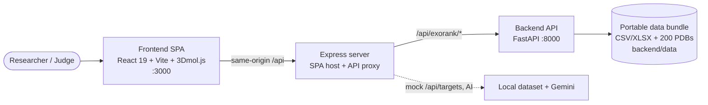

**ASCII:**
```
Researcher
    |
    v
Frontend SPA (React + 3Dmol, :3000)
    |  same-origin /api
    v
Express server  --(/api/exorank/*)-->  FastAPI backend (:8000)
                                             |
                                             v
                               Portable data bundle (CSV/XLSX + 200 PDBs)
```

---

## 2. Runtime / deployment topology

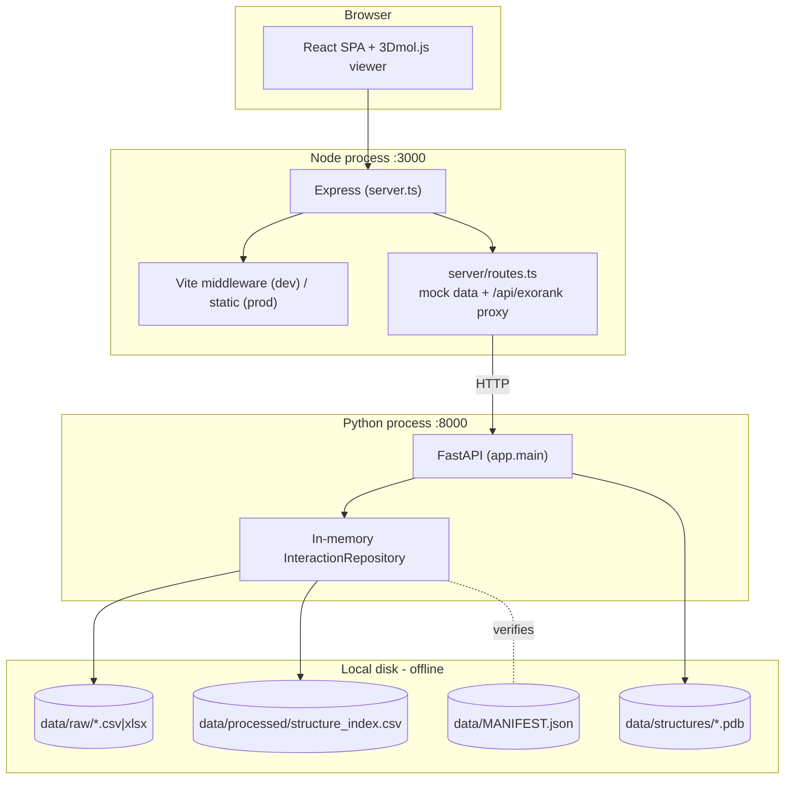

---

## 3. Scientific data pipeline (raw → scores)

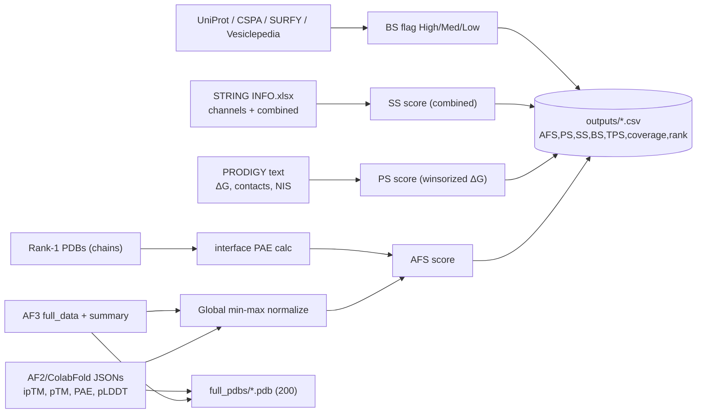

---

## 4. Scoring computation graph (the core formulas)

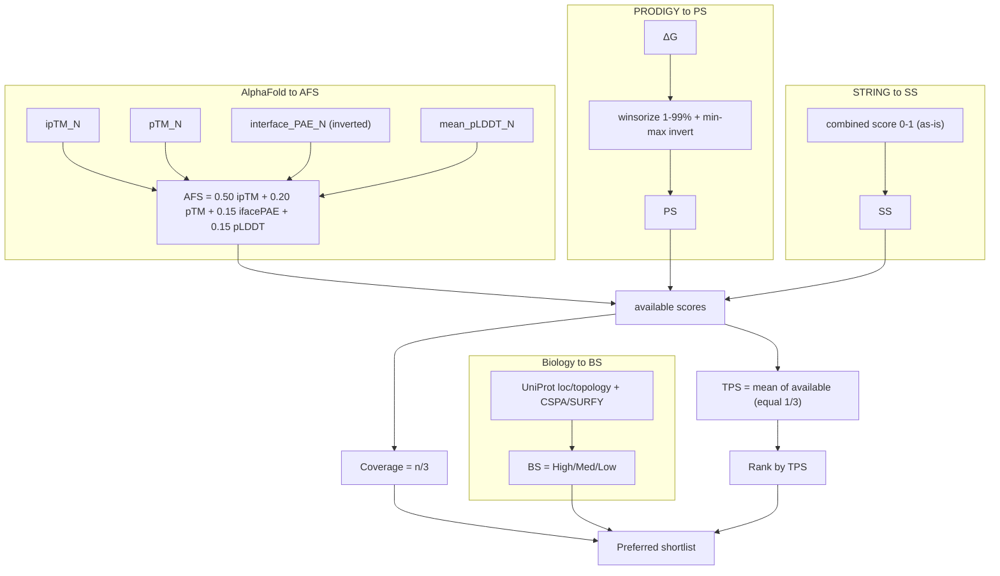

---

## 5. Scoring decision & shortlist gating

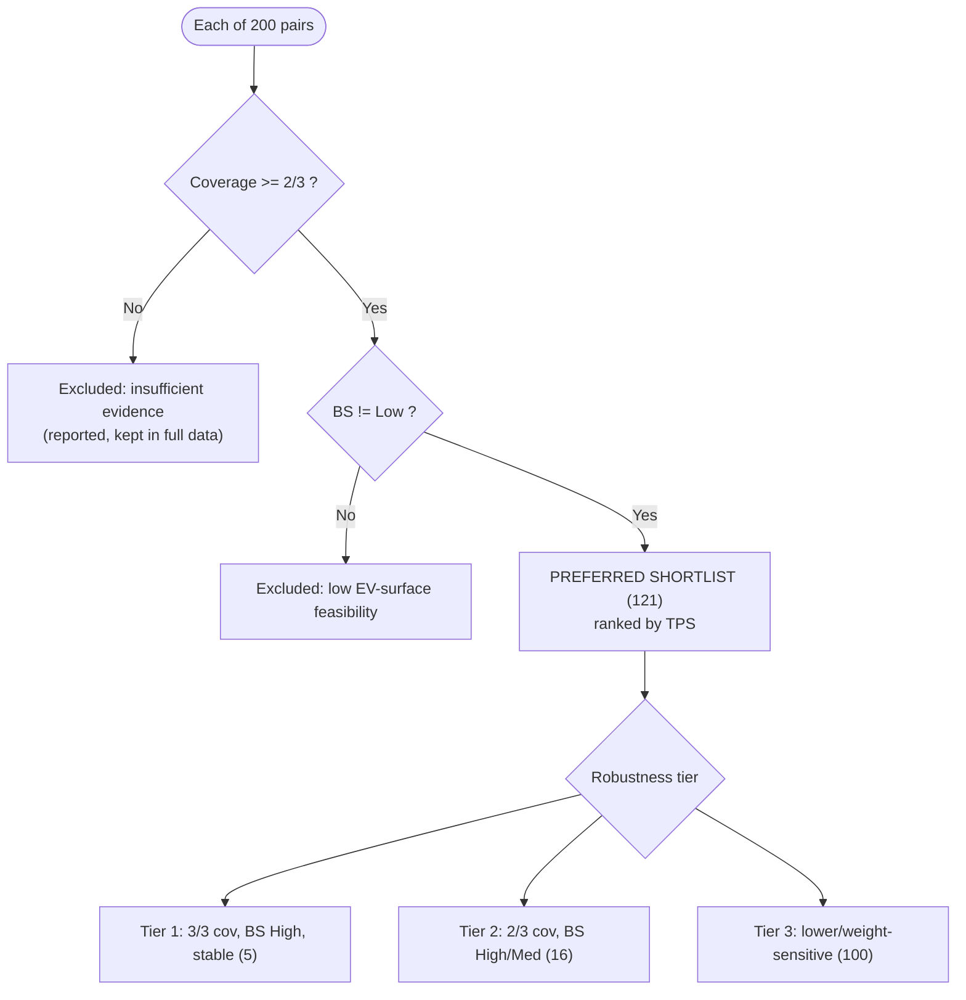

---

## 6. Missing-data handling

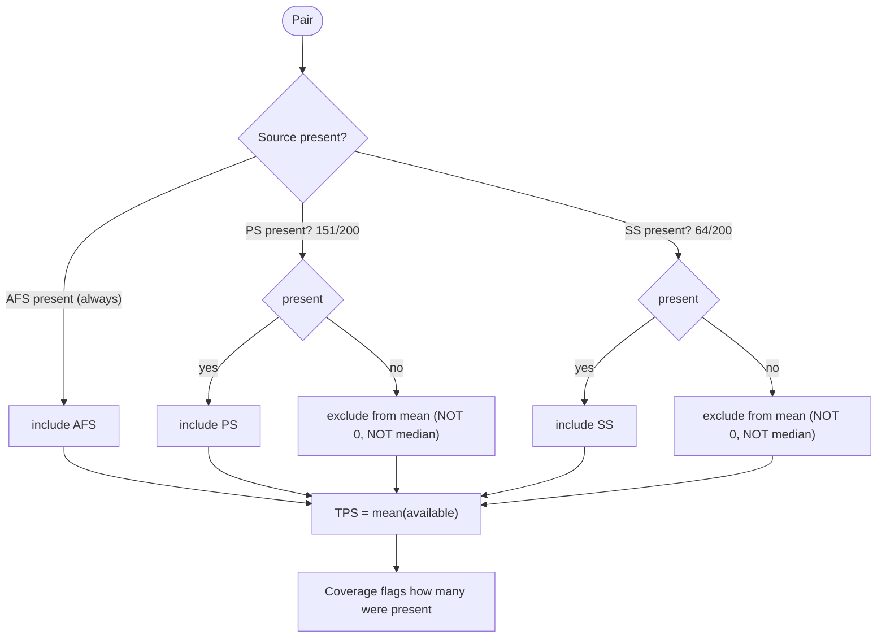

---

## 7. Backend layered architecture

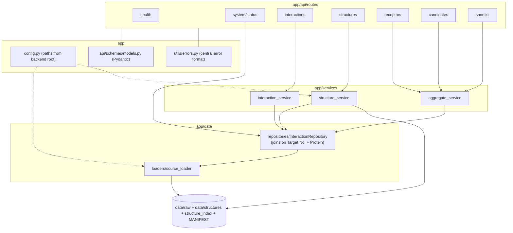

---

## 8. Backend data model — the normalized interaction

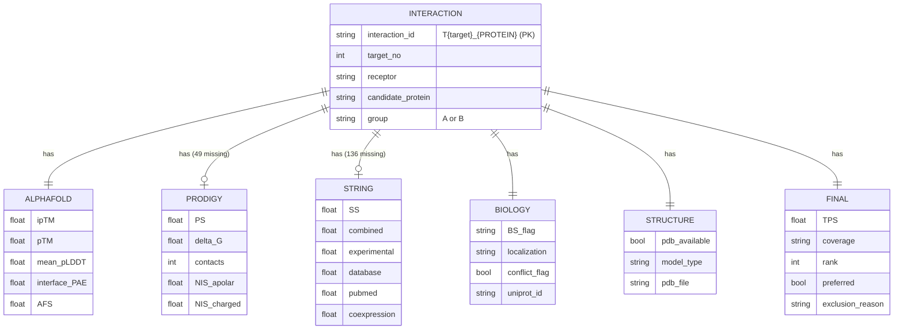

---

## 9. Interaction-ID mapping (frontend ↔ backend)

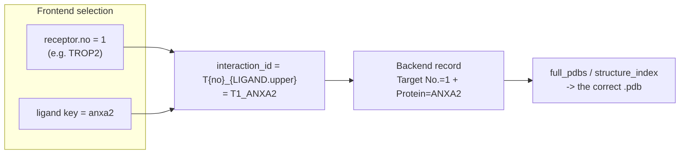

---

## 10. API endpoint map

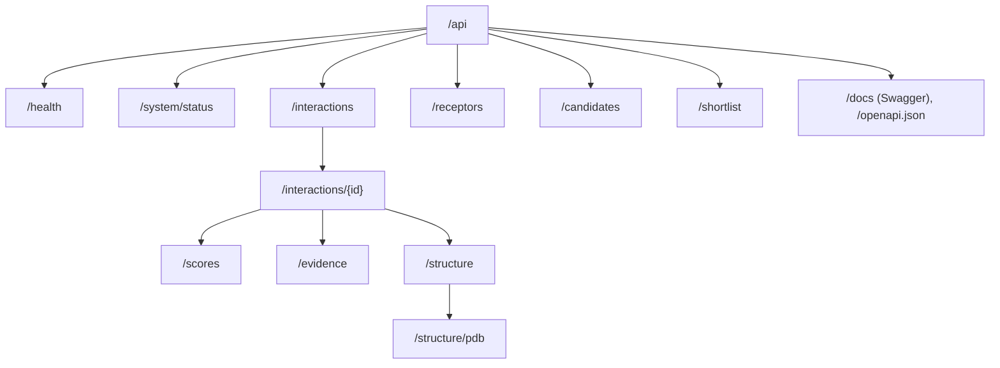

---

## 11. Sequence — load a full interaction

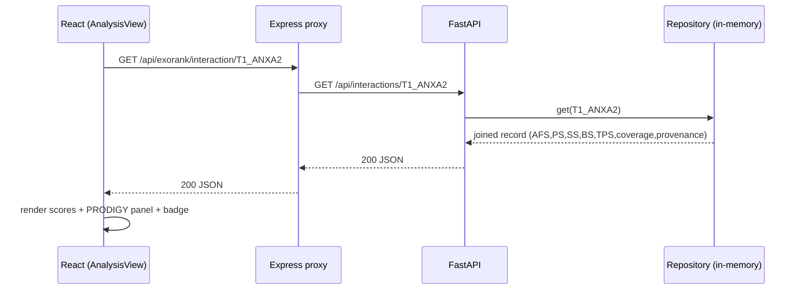

---

## 12. Sequence — 3D structure (PDB) retrieval for the viewer

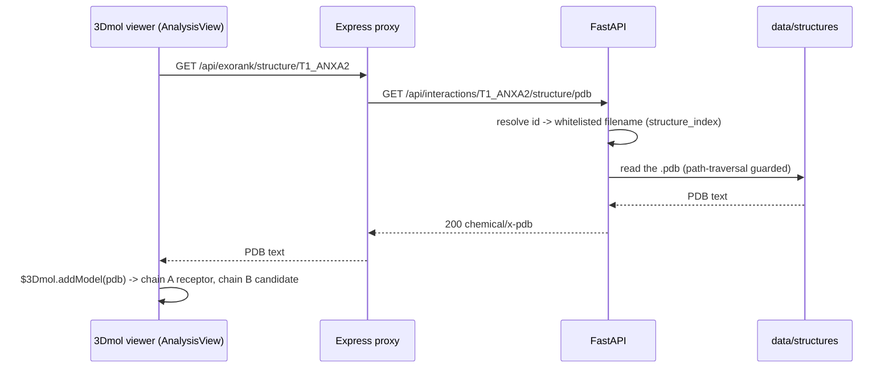

---

## 13. Frontend component tree & data flow

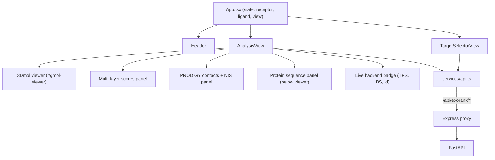

---

## 14. Screening funnel (science)

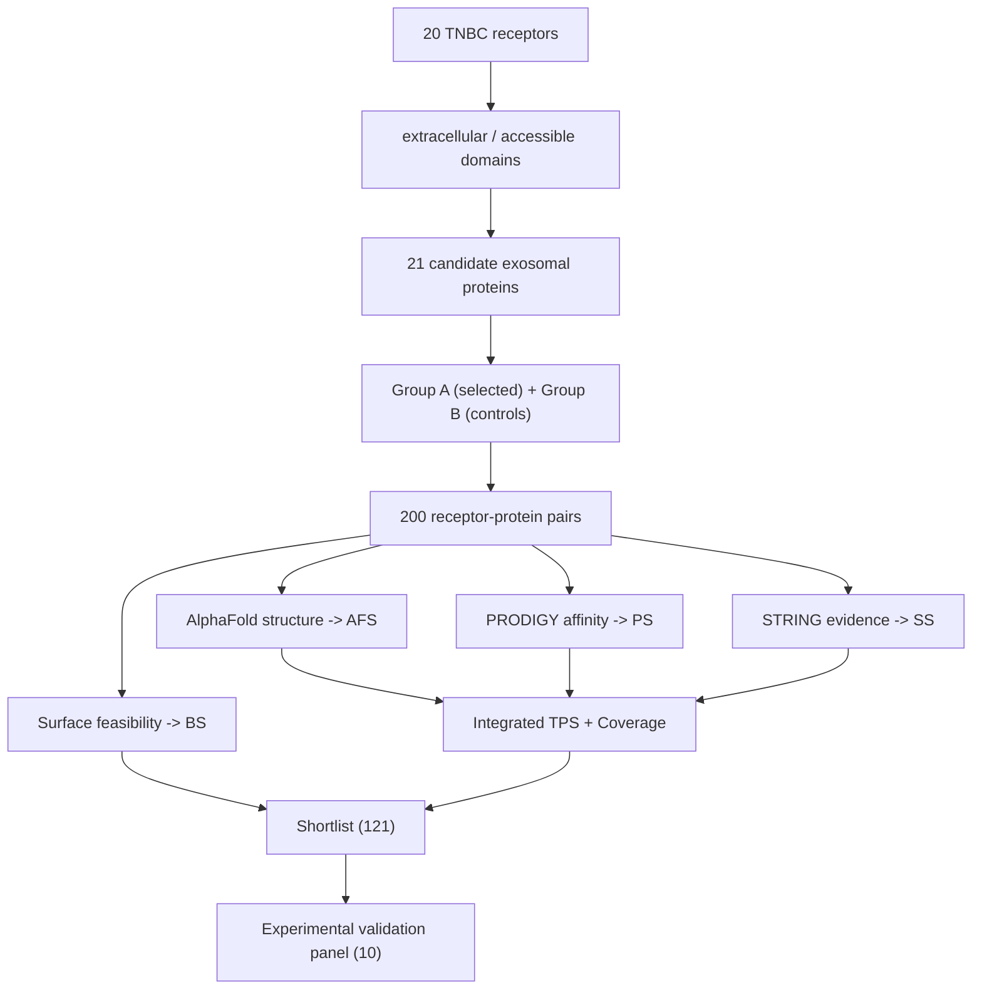

---

## 15. Frontend screen state machine

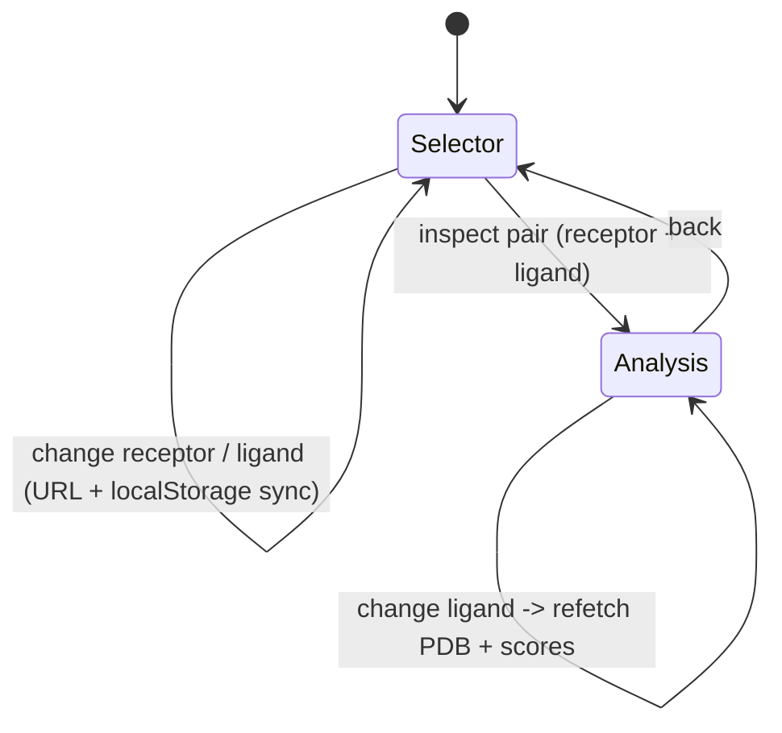

---

## 16. Portable backend package layout

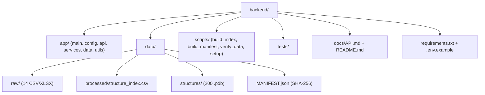

---

### Notes for slides
- Diagrams **1, 2, 4, 7** are the "must-have" architecture slides.
- Diagrams **3, 4, 5, 14** cover the scientific method; **8, 11, 12, 13** cover the software.
- Recolor in your renderer to the sage/forest + terracotta theme for consistency with the deck.
- To export: mermaid.live → "Actions → PNG/SVG", or the VS Code Mermaid extension → right-click → export.
```
